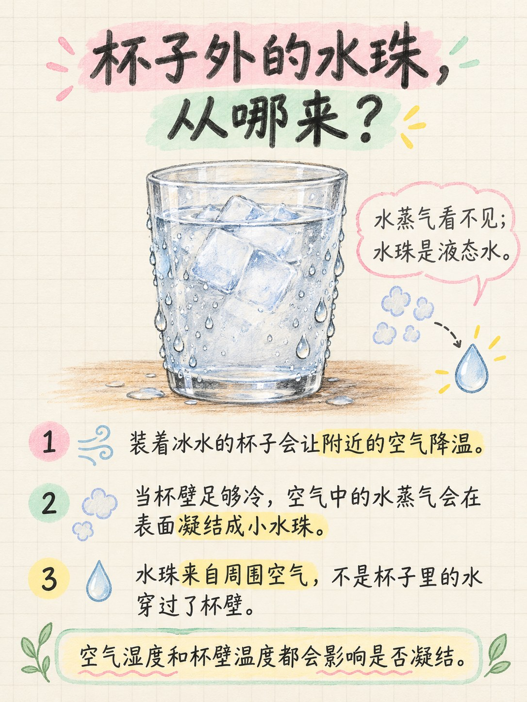
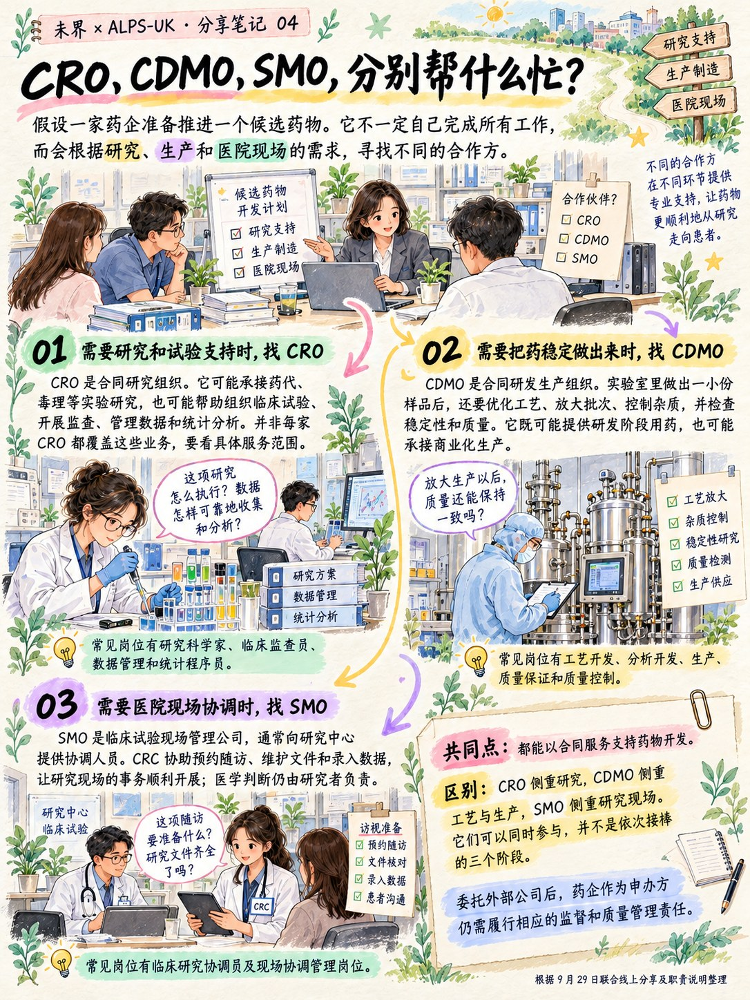
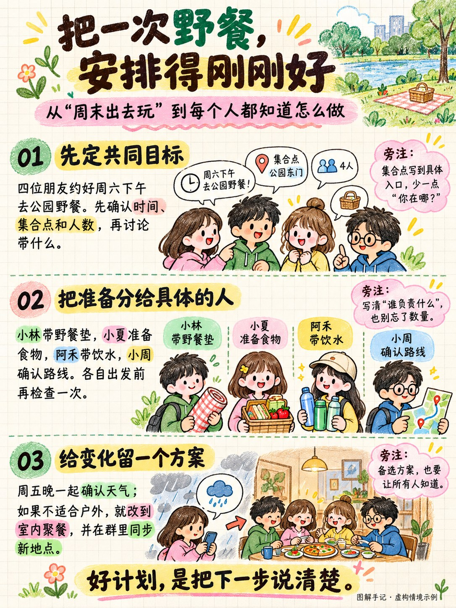
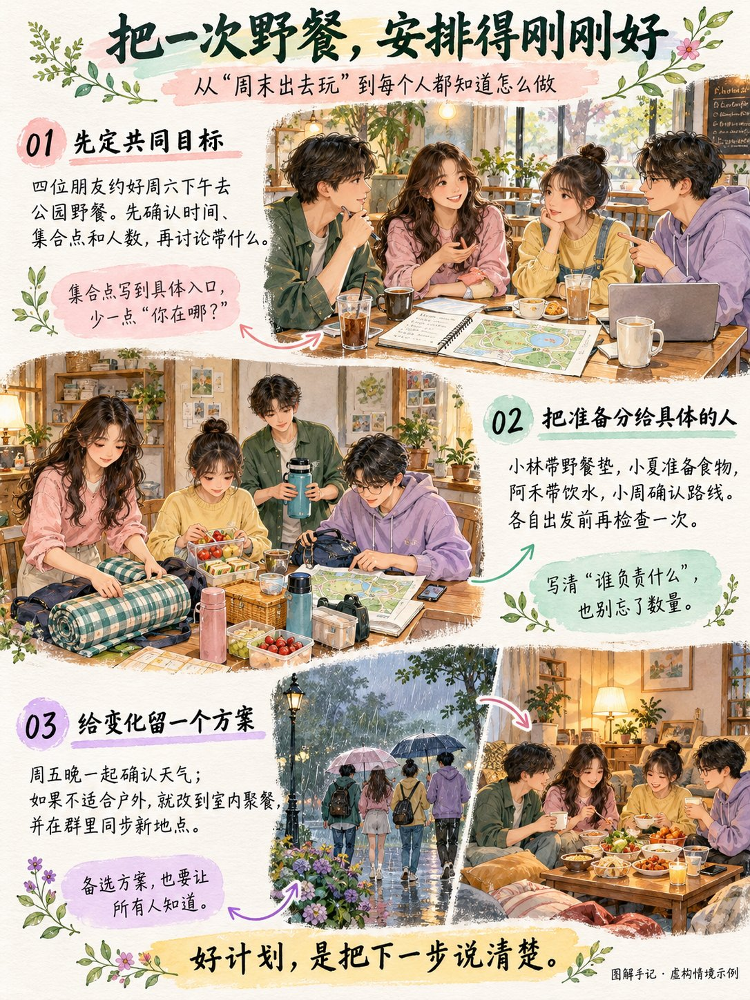

# 图解手记 · Illustrated Notes

把文章、课程和学习资料，整理成讲得清楚、带有手写批注与插画的知识手账。

给它一份资料，告诉它写给谁看、希望讲清什么，就能按内容组织逐页文案，搭配彩色划词、页边批注与场景插画。适合学习整理、教学讲解，也适合公众号、小红书等平台的图文分享。

## 一页笔记里有什么

- **读得懂的正文**：用完整的短段落讲清概念、理由和联系。
- **有帮助的批注**：解释术语、辨析易混点，补充小例子或自测问题。
- **配合内容的插画**：用场景、物件或示意图辅助理解。
- **清楚的阅读顺序**：通过分区、划词和箭头，让信息丰富的页面也容易读下去。

默认采用浅暖纸面、柔和彩色标记和手写风格；有喜欢的参考图，也可以延续它的配色与版式。

## 两种手账风格

| 风格 | 画面特点 | 常见用法 |
| --- | --- | --- |
| 清爽彩铅手账 | 大字、宽松留白、彩铅纹理、简洁可爱的插画 | 单个知识点、语言辨析、短教程 |
| 细腻场景手记 | 细致人物与环境、淡彩水彩、完整短段落、丰富旁注 | 行业地图、课程整理、多概念比较 |

两种风格都可以用于不同主题，也能按内容调整信息量。可以直接指定“清爽彩铅手账”或“细腻场景手记”；提供参考图时，优先沿用参考图的视觉特点。

### 风格展示

**清爽彩铅手账**：用大字、彩色划词和简洁插画，讲清一个知识点。

**细腻场景手记**：用完整短段落、场景插画和页边批注，梳理更多知识关系。

### 同一主题，两种画风

用“把一次野餐安排清楚”这个虚构情境，展示同一份文案的两种视觉表达。

| 清爽彩铅手账 | 细腻场景手记 |
| --- | --- |
|  |  |

## 怎么使用

### 作为 Skill 使用

将本仓库的 `skills/illustrated-notes` 文件夹完整放入你使用的 AI 工具指定的 Skills 目录，保留文件夹内的结构。加载方式以该工具的说明为准。

在支持 `$技能名` 调用的工具中，可以这样说：

> 使用 $illustrated-notes，把下面的资料做成知识手账。读者是新手，页数按内容决定，交付完整图片和简短配文。有参考图时，请沿用它的视觉风格。

### 直接作为提示词使用

打开 [SKILL.md](skills/illustrated-notes/SKILL.md)，将内容复制到 AI 对话中，再附上资料和具体要求。

生成图片需要所用 AI 工具支持图像生成。只需要文案时，可以指定“交付逐页文案”；使用独立绘图工具时，可以指定“交付每页完整出图提示词”。

## 可以怎么用

以下是调用示例，可替换为自己的资料与主题：

| 场景 | 示例要求 |
| --- | --- |
| 读书笔记 | 把这一章整理成知识手账，讲清核心观点、论证和一个具体例子。 |
| 概念辨析 | 根据附件讲清“相关”和“因果”的区别，用同一个例子对照说明。 |
| 语言学习 | 根据这份课程笔记整理易混表达，配上情境例句和旁注。 |
| 操作教程 | 把我的操作记录做成分步教程，标出关键动作和容易出错的地方。 |
| 行业与职业 | 根据提供的资料对比两类岗位，讲清工作内容、协作对象和能力要求。 |

## 提供这些信息，结果会更贴合

**资料 + 目标读者 + 想讲清的问题**，通常就能开始。页数可以按内容安排；参考图、图片比例、配色与署名按需要补充。

可直接复制：

> 请把以下资料整理成一组知识手账。  
> 目标读者：对这个主题感兴趣的新手。  
> 阅读目标：看完能理解核心概念，以及它们之间的联系。  
> 风格：浅暖纸面、清楚的正文、柔和彩色划词、有信息量的手写批注。  
> 页数：按内容安排，保证文字清晰。  
> 交付：完整图片，附一个标题和简短配文。  
> 资料：粘贴正文或附上文件。
